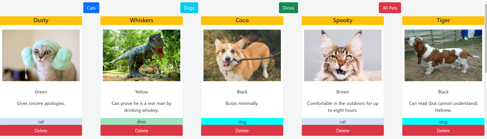

# Name of the Project
Pet-Adoption

## Overview of the project
Use JavaScript to dynamically deploy array of pets with functions of filtering pets by categories as well as user can delete pets that are no longer available.

## Link to your wireframes/prototype
No wireframes were used for this project.

### Link to the deployed project (will learn in week 5)
<https://cs-pet-adoption.netlify.app>

### Link to your project board (yes...even though it is a part of the repo)
<https://github.com/chiestroud/pet-adoption/projects>

### Description of the user
Any user

### List of features
* Filter by pet category using buttons
* Delete function removes pet from the list

### Screenshots of your project

### List of contributors and links to their GH profiles
<https://github.com/chiestroud>

### Link to Loom video walkthrough of your app (no more than 1 minute long! Make it great)

<https://www.loom.com/share/39e570122bf145219c219b91be17ae33>

### Below shows the original requirement to complete this project

### Adoption Website

### Setup
* Clone this repo to your exercises directory
* Create a setup branch and push up the usual stuff
* Review the [Instructions](instructions.md)

### UPDATE THIS README WHEN THE ASSIGNMENT IS COMPLETED
